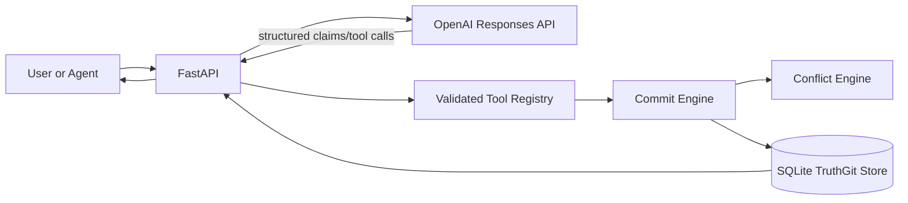
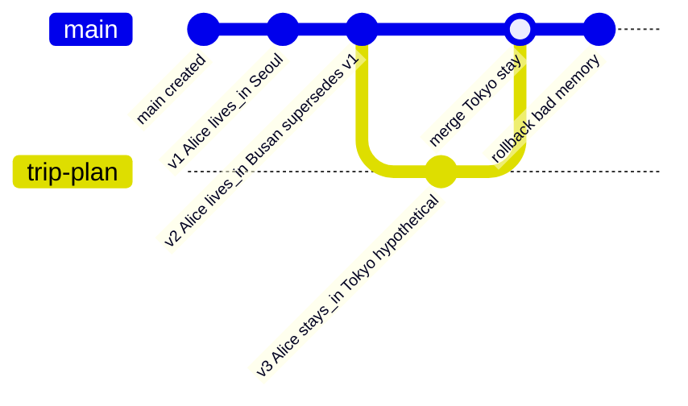

# TruthGit: Version-Controlled Belief Memory for LLM Agents

TruthGit is an MVP research prototype for LLM agent memory where facts are tracked like commits instead of stored as anonymous vector chunks. Each belief version records who introduced it, when, from which source, what it supersedes, which branch it belongs to, and why it changed.

This is not a generic RAG chatbot. RAG retrieves passages; TruthGit maintains auditable belief state. The durable memory layer is deterministic Python plus SQLite. The LLM can extract candidate claims, plan answers, and explain history, but it never writes raw SQL or mutates belief state directly.

## Architecture



TruthGit has two memory layers:

- Short-term request/session state: staged claims and the current chat turn.
- Long-term store: SQLite tables for sources, branches, commits, beliefs, belief versions, and audit events.
- Durable review queue: proposed belief writes are stored in `staged_commits` before they become commits.

## Schema

- `Source`: provenance for a claim, including type, ref, excerpt, and trust score.
- `Branch`: active, merged, or archived belief branch.
- `Commit`: version-control operation such as add, update, merge, rollback, or retract.
- `Belief`: stable subject+predicate identity, using `canonical_key`.
- `BeliefVersion`: the actual claim object, confidence, temporal window, status, source, lineage, contradiction group, and metadata.
- `StagedCommit`: reviewable proposed memory write containing extracted claims, source metadata, risk reasons, reviewer notes, and the applied commit id once approved.
- `AuditEvent`: append-only operation log with integer `entity_id` plus optional string `entity_key` for UUID-backed entities such as staged commits.

## Belief Versioning

If Alice lives in Seoul and a later supported claim says Alice moved to Busan in March 2026, TruthGit does not overwrite the old belief. It creates a new `BeliefVersion`, marks the old one `superseded`, and links the new version through `supersedes_version_id`.

Memory writes are reviewable. `/chat` and `/ingest` persist extracted claims as staged commits first. Low-risk staged writes may auto-apply when `auto_commit=true`; low-trust sources, low-confidence claims, and important predicates such as `lives_in` or `works_at` require explicit approval.



## Run Locally

```powershell
python -m venv .venv
.\.venv\Scripts\Activate.ps1
pip install -r requirements.txt
copy .env.example .env
alembic upgrade head
uvicorn app.main:app --reload
```

Without `OPENAI_API_KEY`, local demos and tests use a deterministic fallback extractor for simple research scenarios.

Run tests:

```powershell
pytest
```

Run the demo seed script:

```powershell
python -m app.demo_seed
```

Open the local memory dashboard:

```powershell
start http://127.0.0.1:8000/viz
```

`/viz` shows staged writes, branch state, belief versions, provenance sources, contradiction groups, and the audit timeline from the live SQLite database.

## Example API Calls

### 1. Add A Belief

```powershell
curl -X POST http://127.0.0.1:8000/chat `
  -H "Content-Type: application/json" `
  -d "{\"message\":\"Alice lives in Seoul.\"}"
```

Sample response:

```json
{
  "answer": "Staged 1 claim(s) for review as 64cf... TruthGit memory was not updated yet.",
  "memory_updated": false,
  "created_commit_id": null,
  "staged_commit_id": "64cf...",
  "review_required": true,
  "branch": {"id": 1, "name": "main", "status": "active"},
  "warnings": ["Important predicate 'lives_in' requires review."]
}
```

Approve the staged write:

```powershell
curl -X POST http://127.0.0.1:8000/staged/64cf.../approve `
  -H "Content-Type: application/json" `
  -d "{\"reviewer\":\"human\",\"notes\":\"verified source\"}"
```

### 2. Supersede A Belief

```powershell
curl -X POST http://127.0.0.1:8000/chat `
  -H "Content-Type: application/json" `
  -d "{\"message\":\"Alice moved to Busan in March 2026.\"}"
```

Sample response:

```json
{
  "answer": "Staged 1 claim(s) for review as 91ad... TruthGit memory was not updated yet.",
  "memory_updated": false,
  "staged_commit_id": "91ad...",
  "review_required": true
}
```

After approval, the applied commit records Busan as a new belief version that supersedes Seoul.

### 3. Query Active Truth

```powershell
curl "http://127.0.0.1:8000/beliefs/active?subject=Alice&predicate=lives_in"
```

Sample response:

```json
[
  {
    "id": 2,
    "object_value": "Busan",
    "status": "active",
    "supersedes_version_id": 1
  }
]
```

### 4. Create A Branch

```powershell
curl -X POST http://127.0.0.1:8000/branches `
  -H "Content-Type: application/json" `
  -d "{\"name\":\"trip-plan\",\"description\":\"Hypothetical conference travel\"}"
```

Sample response:

```json
{
  "id": 2,
  "name": "trip-plan",
  "parent_branch_id": 1,
  "status": "active"
}
```

### 5. Roll Back A Commit

```powershell
curl -X POST http://127.0.0.1:8000/commits/3/rollback `
  -H "Content-Type: application/json" `
  -d "{\"message\":\"Rollback bad low-trust memory\"}"
```

Sample response:

```json
{
  "commit": {"operation_type": "rollback"},
  "introduced_versions": [{"status": "retracted"}],
  "restored_versions": [{"status": "active"}],
  "warnings": []
}
```

### 6. Reject A Staged Write

```powershell
curl -X POST http://127.0.0.1:8000/staged/64cf.../reject `
  -H "Content-Type: application/json" `
  -d "{\"reviewer\":\"human\",\"notes\":\"unsupported claim\"}"
```

Rejected staged writes remain auditable but never create durable `BeliefVersion` records.

## Why This Differs From RAG

RAG usually answers from retrieved chunks and leaves truth state implicit. TruthGit makes truth state explicit:

- beliefs are atomic
- updates preserve lineage
- branch hypotheses do not overwrite main truth
- merge and rollback are first-class operations
- conflicts are explainable from structured provenance
- audit logs show every durable mutation

## Changing-World Benchmark V3

The `experiments/` package adds a deterministic synthetic benchmark for research comparisons. Benchmark v3 phase 2 generates 86 changing-world cases and 161 structured questions with:

- superseded facts
- conflicting sources
- branch-only hypothetical facts
- rollback-needed bad commits
- provenance questions
- timeline questions
- poisoning and low-trust source cases
- branch leakage cases
- harder temporal supersession chains
- exact source-tracking questions
- multiple-source current-justification questions
- rollback-cleaned provenance questions
- branch-specific provenance questions
- unresolved/manual-review merge questions
- concurrent main-vs-branch update questions
- same-object rollback-invalidated source questions
- two-competing-branch merge questions
- temporal coexistence merge questions

Run the first paper table with one backbone label, `gpt-4o-mini`:

```powershell
python -m experiments.run_benchmark `
  --output-dir experiments\results `
  --backbone gpt-4o-mini
```

Run the ablation table:

```powershell
python -m experiments.run_benchmark `
  --output-dir experiments\results `
  --backbone gpt-4o-mini `
  --include-ablations
```

This writes:

- `experiments/results/benchmark_results.json`
- `experiments/results/metric_summary.csv`
- `experiments/results/question_scores.csv`
- `experiments/results/predictions.csv`

Plot the metric summary:

```powershell
python -m experiments.plot_results `
  --summary-csv experiments\results\metric_summary.csv `
  --output-png experiments\results\metric_summary.png
```

The frozen paper draft for the current Benchmark v3 phase 2 table is in `docs/paper_draft.md`.

Compared systems:

- `naive_chat_history`: flat append-only memory with no durable revision semantics.
- `simple_rag`: retrieves the highest lexical/trust matching chunk but has no branch, rollback, or lineage model.
- `embedding_rag`: local TF-IDF embedding baseline with cosine retrieval over memory chunks.
- `truthgit`: uses the real branch, commit, conflict, merge, rollback, and audit engines.

Ablations:

- `truthgit_no_branches`
- `truthgit_no_rollback`
- `truthgit_no_review_gate`
- `truthgit_no_trust_scoring`

Metrics:

- `current_truth_accuracy`
- `historical_truth_accuracy`
- `provenance_accuracy`
- `rollback_recovery_rate`
- `branch_isolation_score`
- `merge_conflict_resolution_score`
- `low_trust_warning_rate`

## Paper-Oriented Notes

### Hypothesis

LLM agents operating in changing worlds will answer current, historical, provenance, rollback, and hypothetical-branch questions more reliably when memory is represented as versioned belief state rather than as flat chat history or unversioned RAG chunks.

### Experimental Setup

The synthetic benchmark feeds each system the same sequence of world-changing events. Some events revise prior truth, some introduce low-trust conflicts, some live only on hypothetical branches, and some require rollback. Systems are evaluated with exact structured questions whose expected answers are known from the generated world state.

TruthGit is evaluated through its real deterministic service layer: `Source`, `Branch`, `Commit`, `Belief`, `BeliefVersion`, and `AuditEvent` records are created in SQLite, and answers are read from active branch state or lineage history. Baselines keep simplified in-memory records so the comparison isolates the value of version-control semantics.

### Current Benchmark Interpretation

The current table uses `gpt-4o-mini` as the backbone label and deterministic benchmark adapters for all memory systems. The strongest result is structural: TruthGit reaches 1.0 on current truth, exact ordered history, exact current provenance, rollback recovery, branch isolation, low-trust warning, and merge conflict resolution, while the flat and RAG baselines fail the columns that require explicit version-control state.

| System | Current | History | Provenance | Rollback | Branch | Merge | Low-trust |
| --- | ---: | ---: | ---: | ---: | ---: | ---: | ---: |
| naive chat history | 0.545 | 0.545 | 0.661 | 0.000 | 0.500 | 0.400 | 0.000 |
| simple RAG | 1.000 | 0.545 | 0.729 | 0.000 | 0.500 | 0.350 | 0.000 |
| embedding RAG | 1.000 | 0.273 | 0.729 | 0.000 | 0.500 | 0.400 | 0.000 |
| TruthGit | 1.000 | 1.000 | 1.000 | 1.000 | 1.000 | 1.000 | 1.000 |

Benchmark v3 phase 2 makes provenance discriminative. The generator now includes same-object corroboration, rollback-invalidated sources, branch-specific current sources, and merge-governing sources. TruthGit handles these by making stronger same-object corroboration a versioned provenance update instead of treating it as a no-op duplicate.

The merge column is also more discriminative. Resolved high-trust branch merges, unresolved manual-review merges, concurrent main-vs-branch updates, two competing branches, and temporal coexistence cases are scored. Flat baselines can sometimes return the right object, but they cannot mark concurrent branch-vs-main changes as unresolved conflicts or answer time-sliced merge questions because they do not maintain branch-local lineage, contradiction groups, or temporal validity windows.

### Limitations

The benchmark is synthetic and still much smaller than a deployed agent workload. It measures structured memory correctness rather than full natural-language response quality. The embedding baseline is local TF-IDF rather than a production neural retriever with reranking and temporal post-processing. TruthGit still uses hand-written conflict and merge policies rather than learned or probabilistic trust calibration. Same-object corroboration is currently represented by a new governing belief version, while a fuller system should retain all corroborating sources as a support set.

### Future Work

Expand the generator into larger stochastic worlds, add adversarial memory poisoning cases, evaluate with embedding-based RAG baselines, add human-labeled provenance difficulty tiers, and test whether agents can learn when to create branches, request clarification, or require human review before committing high-impact beliefs.

## Next Research Upgrades

- Provenance scoring: learn trust calibration from source type, recency, citations, and corroboration.
- Memory poisoning defense: quarantine low-trust updates, require review for high-impact predicates, and detect adversarial source patterns.
- Temporal reasoning benchmark: evaluate whether agents answer current, historical, and branch-specific truth questions correctly.
- Branch policy learning: learn when to create hypothetical branches instead of updating main memory.
- Trust-aware merge policy: combine deterministic rules with calibrated evidence scoring and human review thresholds.
