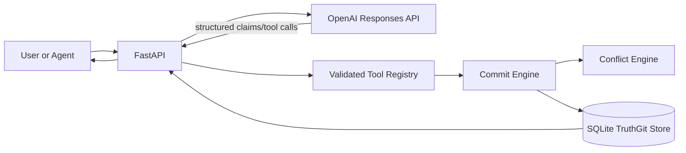
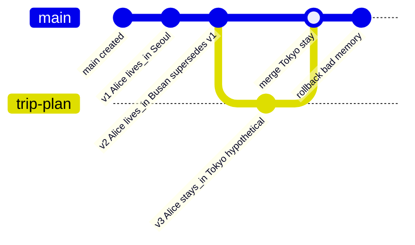

# TruthGit: Version-Controlled Belief Memory for LLM Agents

TruthGit is an MVP research prototype for LLM agent memory where facts are tracked like commits instead of stored as anonymous vector chunks. Each belief version records who introduced it, when, from which source, what it supersedes, which branch it belongs to, and why it changed.

This is not a generic RAG chatbot. RAG retrieves passages; TruthGit maintains auditable belief state. The durable memory layer is deterministic Python plus SQLite. The LLM can extract candidate claims, plan answers, and explain history, but it never writes raw SQL or mutates belief state directly.

## Architecture



TruthGit has two memory layers:

- Short-term request/session state: staged claims and the current chat turn.
- Long-term store: SQLite tables for sources, branches, commits, beliefs, belief versions, and audit events.

## Schema

- `Source`: provenance for a claim, including type, ref, excerpt, and trust score.
- `Branch`: active, merged, or archived belief branch.
- `Commit`: version-control operation such as add, update, merge, rollback, or retract.
- `Belief`: stable subject+predicate identity, using `canonical_key`.
- `BeliefVersion`: the actual claim object, confidence, temporal window, status, source, lineage, contradiction group, and metadata.
- `AuditEvent`: append-only operation log.

## Belief Versioning

If Alice lives in Seoul and a later supported claim says Alice moved to Busan in March 2026, TruthGit does not overwrite the old belief. It creates a new `BeliefVersion`, marks the old one `superseded`, and links the new version through `supersedes_version_id`.



## Run Locally

```powershell
python -m venv .venv
.\.venv\Scripts\Activate.ps1
pip install -r requirements.txt
copy .env.example .env
alembic upgrade head
uvicorn app.main:app --reload
```

Without `OPENAI_API_KEY`, local demos and tests use a deterministic fallback extractor for simple research scenarios.

Run tests:

```powershell
pytest
```

Run the demo seed script:

```powershell
python -m app.demo_seed
```

## Example API Calls

### 1. Add A Belief

```powershell
curl -X POST http://127.0.0.1:8000/chat `
  -H "Content-Type: application/json" `
  -d "{\"message\":\"Alice lives in Seoul.\"}"
```

Sample response:

```json
{
  "answer": "Recorded: Alice lives_in Seoul as version 1 on branch 'main'.",
  "memory_updated": true,
  "created_commit_id": 1,
  "branch": {"id": 1, "name": "main", "status": "active"},
  "warnings": []
}
```

### 2. Supersede A Belief

```powershell
curl -X POST http://127.0.0.1:8000/chat `
  -H "Content-Type: application/json" `
  -d "{\"message\":\"Alice moved to Busan in March 2026.\"}"
```

Sample response:

```json
{
  "answer": "Recorded: Alice lives_in Busan as version 2 on branch 'main', superseding version 1.",
  "memory_updated": true,
  "created_commit_id": 2,
  "warnings": []
}
```

### 3. Query Active Truth

```powershell
curl "http://127.0.0.1:8000/beliefs/active?subject=Alice&predicate=lives_in"
```

Sample response:

```json
[
  {
    "id": 2,
    "object_value": "Busan",
    "status": "active",
    "supersedes_version_id": 1
  }
]
```

### 4. Create A Branch

```powershell
curl -X POST http://127.0.0.1:8000/branches `
  -H "Content-Type: application/json" `
  -d "{\"name\":\"trip-plan\",\"description\":\"Hypothetical conference travel\"}"
```

Sample response:

```json
{
  "id": 2,
  "name": "trip-plan",
  "parent_branch_id": 1,
  "status": "active"
}
```

### 5. Roll Back A Commit

```powershell
curl -X POST http://127.0.0.1:8000/commits/3/rollback `
  -H "Content-Type: application/json" `
  -d "{\"message\":\"Rollback bad low-trust memory\"}"
```

Sample response:

```json
{
  "commit": {"operation_type": "rollback"},
  "introduced_versions": [{"status": "retracted"}],
  "restored_versions": [{"status": "active"}],
  "warnings": []
}
```

## Why This Differs From RAG

RAG usually answers from retrieved chunks and leaves truth state implicit. TruthGit makes truth state explicit:

- beliefs are atomic
- updates preserve lineage
- branch hypotheses do not overwrite main truth
- merge and rollback are first-class operations
- conflicts are explainable from structured provenance
- audit logs show every durable mutation

## Changing-World Benchmark

The `experiments/` package adds a deterministic synthetic benchmark for research comparisons. It generates cases with:

- superseded facts
- conflicting sources
- branch-only hypothetical facts
- rollback-needed bad commits
- provenance questions
- timeline questions

Run the benchmark:

```powershell
python -m experiments.run_benchmark --output-dir experiments\results
```

This writes:

- `experiments/results/benchmark_results.json`
- `experiments/results/metric_summary.csv`
- `experiments/results/question_scores.csv`
- `experiments/results/predictions.csv`

Plot the metric summary:

```powershell
python -m experiments.plot_results `
  --summary-csv experiments\results\metric_summary.csv `
  --output-png experiments\results\metric_summary.png
```

Compared systems:

- `naive_chat_history`: flat append-only memory with no durable revision semantics.
- `simple_rag`: retrieves the highest lexical/trust matching chunk but has no branch, rollback, or lineage model.
- `truthgit`: uses the real branch, commit, conflict, merge, rollback, and audit engines.

Metrics:

- `current_truth_accuracy`
- `historical_truth_accuracy`
- `provenance_accuracy`
- `rollback_recovery_rate`
- `branch_isolation_score`
- `merge_conflict_resolution_score`
- `low_trust_warning_rate`

## Paper-Oriented Notes

### Hypothesis

LLM agents operating in changing worlds will answer current, historical, provenance, rollback, and hypothetical-branch questions more reliably when memory is represented as versioned belief state rather than as flat chat history or unversioned RAG chunks.

### Experimental Setup

The synthetic benchmark feeds each system the same sequence of world-changing events. Some events revise prior truth, some introduce low-trust conflicts, some live only on hypothetical branches, and some require rollback. Systems are evaluated with exact structured questions whose expected answers are known from the generated world state.

TruthGit is evaluated through its real deterministic service layer: `Source`, `Branch`, `Commit`, `Belief`, `BeliefVersion`, and `AuditEvent` records are created in SQLite, and answers are read from active branch state or lineage history. Baselines keep simplified in-memory records so the comparison isolates the value of version-control semantics.

### Limitations

The benchmark is synthetic and currently small. It measures structured memory correctness rather than full natural-language response quality. The simple RAG baseline is intentionally lightweight and does not include embeddings, reranking, or temporal post-processing. TruthGit still uses hand-written conflict and merge policies rather than learned or probabilistic trust calibration.

### Future Work

Expand the generator into larger stochastic worlds, add adversarial memory poisoning cases, evaluate with embedding-based RAG baselines, add human-labeled provenance difficulty tiers, and test whether agents can learn when to create branches, request clarification, or require human review before committing high-impact beliefs.

## Next Research Upgrades

- Provenance scoring: learn trust calibration from source type, recency, citations, and corroboration.
- Memory poisoning defense: quarantine low-trust updates, require review for high-impact predicates, and detect adversarial source patterns.
- Temporal reasoning benchmark: evaluate whether agents answer current, historical, and branch-specific truth questions correctly.
- Branch policy learning: learn when to create hypothetical branches instead of updating main memory.
- Trust-aware merge policy: combine deterministic rules with calibrated evidence scoring and human review thresholds.
