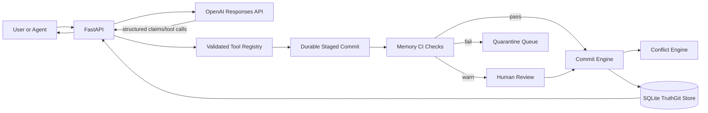
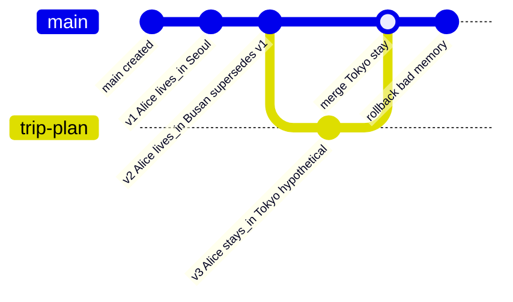

# TruthGit: Version-Controlled Belief Memory for LLM Agents

TruthGit is an MVP research prototype for LLM agent memory where facts are tracked like commits instead of stored as anonymous vector chunks. Each belief version records who introduced it, when, from which source, what it supersedes, which branch it belongs to, and why it changed.

This is not a generic RAG chatbot. RAG retrieves passages; TruthGit maintains auditable belief state. The durable memory layer is deterministic Python plus SQLite. The LLM can extract candidate claims, plan answers, and explain history, but it never writes raw SQL or mutates belief state directly.

## Architecture



TruthGit has two memory layers:

- Short-term request/session state: staged claims and the current chat turn.
- Long-term store: SQLite tables for sources, branches, commits, beliefs, belief versions, and audit events.
- Durable review queue: proposed belief writes are stored in `staged_commits` before they become commits.

## Schema

- `Source`: provenance for a claim, including type, ref, excerpt, and trust score.
- `Branch`: active, merged, or archived belief branch.
- `Commit`: version-control operation such as add, update, merge, rollback, or retract.
- `Belief`: stable subject+predicate identity, using `canonical_key`.
- `BeliefVersion`: the actual claim object, confidence, temporal window, status, source, lineage, contradiction group, and metadata.
- `BeliefVersionSourceLink`: support/opposition graph edges connecting each belief version to all sources that currently support it, oppose it, were rolled back, or were superseded.
- `StagedCommit`: reviewable proposed memory write containing extracted claims, source metadata, lifecycle status, risk reasons, latest CI run, quarantine fields, reviewer notes, and the applied commit id once approved.
- `MemoryCheckRun`: one durable Memory CI execution against a staged commit, with suite version, pass/warn/fail status, deterministic decision, score, timestamps, and metadata.
- `MemoryCheckResult`: one named check result in a CI run, including severity, pass/fail bit, reason code, message, payload, and timestamp.
- `AuditEvent`: append-only operation log with integer `entity_id` plus optional string `entity_key` for UUID-backed entities such as staged commits.

## Belief Versioning

If Alice lives in Seoul and a later supported claim says Alice moved to Busan in March 2026, TruthGit does not overwrite the old belief. It creates a new `BeliefVersion`, marks the old one `superseded`, and links the new version through `supersedes_version_id`.

Memory writes are model-proposed and CI-governed. The LLM returns a structured `MemoryWritePlan` with open predicates, branch name, trust score, `write_action`, risk reasons, warnings, and a short assistant reply. Python validates the shape and always creates a durable staged commit before mutation. Memory CI then routes the proposal:

- `PASS`: low-risk write can auto-apply when `auto_commit=true`;
- `WARN`: write becomes `review_required` and needs reviewer approval;
- `FAIL`: write becomes `quarantined` and cannot become active truth until release, rejection, or explicit override;
- `REJECT`: invalid proposal is recorded and rejected without belief mutation.

The LLM still cannot write raw SQL or bypass deterministic validation.

## Memory CI/CD And Quarantine

TruthGit treats proposed memory writes like code going through CI. The initial check suite is deterministic and repo-local:

- low-trust source check;
- protected predicate review check;
- contradiction spike check;
- temporal overlap check;
- branch leakage risk check;
- rollback regression check;
- suspicious same-object corroboration check;
- merge conflict policy check;
- duplicate source anomaly check;
- support gap check.

Checks are registered through a policy/config layer rather than embedded as one-off conditionals. Predicate policy classes such as `low_risk`, `identity_state`, `financial`, and `operational_deadline` define trust thresholds, review requirements, support-count expectations, and branch-leakage sensitivity. Predicates remain model-generated open labels; the deterministic layer maps them into policy classes by generic exact/regex rules, not benchmark IDs.

Quarantine is not a boolean flag. It is a durable lifecycle state on `StagedCommit` with timestamps, reason summary, release status, reviewer, notes, CI run records, per-check results, and audit events. Quarantined items remain visible through `/quarantine`, `/viz`, `/demo`, and `/audit`, but they do not create active belief versions unless a reviewer explicitly releases or overrides them.

## Support-Set Truth Maintenance

TruthGit now tracks provenance as a source graph, not only as one winning `source_id`. Every belief version has:

- active support sources that currently justify the belief
- opposition sources that contradict it
- rolled-back sources that no longer justify it
- superseded opposition sources that remain historical but no longer govern current truth

Same-object corroboration no longer creates a redundant replacement version. It adds another active support edge to the existing version. Rolling back that corroborating commit removes only that support edge; the belief remains active if other support sources still justify it. Conflicting claims add opposition edges in both directions, while branch-only hypothetical opposition does not weaken main-branch truth. Current truth ranking uses the evolving support graph rather than trusting one retrieved record directly.



## Run Locally

```powershell
python -m venv .venv
.\.venv\Scripts\Activate.ps1
pip install -r requirements.txt
copy .env.example .env
alembic upgrade head
uvicorn app.main:app --reload
```

Without `OPENAI_API_KEY`, local demos and tests use a deterministic fallback extractor for simple research scenarios.

Run tests:

```powershell
pytest
```

Run the governance benchmark extension:

```powershell
python -m experiments.governance_benchmark --output-dir experiments/results
```

This writes:

- `experiments/results/governance_benchmark_results.json`
- `experiments/results/governance_metric_summary.csv`
- `experiments/results/governance_case_results.csv`
- `experiments/results/governance_routing_counts.csv`
- `experiments/results/governance_quarantine_metrics.png`

Run the qualitative Memory CI/CD case study:

```powershell
python -m experiments.memory_ci_case_study --output experiments/results/memory_ci_case_study.json
```

The narrative is documented in `docs/case_study_memory_ci_quarantine.md`.

Run the demo seed script:

```powershell
python -m app.demo_seed
```

Open the local memory dashboard:

```powershell
start http://127.0.0.1:8000/viz
```

`/viz` shows staged writes, branch state, belief versions, provenance sources, contradiction groups, and the audit timeline from the live SQLite database.

Open the professor demo UI:

```powershell
start http://127.0.0.1:8000/demo
```

`/demo` provides a professor-facing chat panel and live git-style memory graph. It shows extraction, staging, model commit/review/reject decisions, supersession, branch-local beliefs, rollback, staged writes, and audit entries as prompts are sent.

## Example API Calls

### 1. Add A Belief

```powershell
curl -X POST http://127.0.0.1:8000/chat `
  -H "Content-Type: application/json" `
  -d "{\"message\":\"Alice lives in Seoul.\"}"
```

Sample response:

```json
{
  "answer": "Okay, I'll remember that in TruthGit memory. Staged 1 claim(s) as 64cf...",
  "memory_updated": false,
  "created_commit_id": null,
  "staged_commit_id": "64cf...",
  "review_required": true,
  "branch": {"id": 1, "name": "main", "status": "active"},
  "warnings": ["Protected predicates require review before automatic durable truth updates."]
}
```

If the model returns `stage_for_review`, approve the staged write:

```powershell
curl -X POST http://127.0.0.1:8000/staged/64cf.../approve `
  -H "Content-Type: application/json" `
  -d "{\"reviewer\":\"human\",\"notes\":\"verified source\"}"
```

### 2. Supersede A Belief

```powershell
curl -X POST http://127.0.0.1:8000/chat `
  -H "Content-Type: application/json" `
  -d "{\"message\":\"Alice moved to Busan in March 2026.\"}"
```

Sample response:

```json
{
  "answer": "Recorded: Alice lives_in Busan as version 2 on branch 'main', superseding version 1.",
  "memory_updated": true,
  "created_commit_id": 2,
  "staged_commit_id": "91ad...",
  "review_required": false
}
```

Inspect CI results:

```powershell
curl "http://127.0.0.1:8000/staged/64cf.../checks"
```

Quarantined low-trust or unsafe writes are visible here:

```powershell
curl "http://127.0.0.1:8000/quarantine"
```

The applied commit records Busan as a new belief version that supersedes Seoul.

### 3. Query Active Truth

```powershell
curl "http://127.0.0.1:8000/beliefs/active?subject=Alice&predicate=lives_in"
```

Sample response:

```json
[
  {
    "id": 2,
    "object_value": "Busan",
    "status": "active",
    "supersedes_version_id": 1
  }
]
```

### 4. Create A Branch

```powershell
curl -X POST http://127.0.0.1:8000/branches `
  -H "Content-Type: application/json" `
  -d "{\"name\":\"trip-plan\",\"description\":\"Hypothetical conference travel\"}"
```

Sample response:

```json
{
  "id": 2,
  "name": "trip-plan",
  "parent_branch_id": 1,
  "status": "active"
}
```

### 5. Roll Back A Commit

```powershell
curl -X POST http://127.0.0.1:8000/commits/3/rollback `
  -H "Content-Type: application/json" `
  -d "{\"message\":\"Rollback bad low-trust memory\"}"
```

Sample response:

```json
{
  "commit": {"operation_type": "rollback"},
  "introduced_versions": [{"status": "retracted"}],
  "restored_versions": [{"status": "active"}],
  "warnings": []
}
```

### 6. Reject A Staged Write

```powershell
curl -X POST http://127.0.0.1:8000/staged/64cf.../reject `
  -H "Content-Type: application/json" `
  -d "{\"reviewer\":\"human\",\"notes\":\"unsupported claim\"}"
```

Rejected staged writes remain auditable but never create durable `BeliefVersion` records.

## Why This Differs From RAG

RAG usually answers from retrieved chunks and leaves truth state implicit. TruthGit makes truth state explicit:

- beliefs are atomic
- updates preserve lineage
- branch hypotheses do not overwrite main truth
- merge and rollback are first-class operations
- conflicts are explainable from structured provenance
- audit logs show every durable mutation

## Changing-World Benchmark V3

The `experiments/` package adds a deterministic synthetic benchmark for research comparisons. Benchmark v4 generates 94 changing-world cases and 171 structured questions with:

- superseded facts
- conflicting sources
- branch-only hypothetical facts
- rollback-needed bad commits
- provenance questions
- timeline questions
- poisoning and low-trust source cases
- branch leakage cases
- harder temporal supersession chains
- exact source-tracking questions
- multiple-source current-justification questions
- exact active support-set questions
- rollback-cleaned provenance questions
- branch-specific provenance questions
- unresolved/manual-review merge questions
- concurrent main-vs-branch update questions
- same-object rollback-invalidated source questions
- two-competing-branch merge questions
- temporal coexistence merge questions

Run the structural memory correctness table:

```powershell
python -m experiments.run_benchmark `
  --output-dir experiments\results `
  --backbone gpt-4o-mini
```

`--backbone` is a metadata label in this structural runner. The loop is deterministic:
each system ingests events, its adapter answers structured questions, and the scorer
checks exact state fields. This table is not a live LLM reasoning result.

Run the ablation table:

```powershell
python -m experiments.run_benchmark `
  --output-dir experiments\results `
  --backbone gpt-4o-mini `
  --include-ablations
```

This writes:

- `experiments/results/benchmark_results.json`
- `experiments/results/metric_summary.csv`
- `experiments/results/question_scores.csv`
- `experiments/results/predictions.csv`

Run the separate model-in-the-loop table, where every system exposes retrieved
memory context and the same reader model parses that context into a structured
answer:

```powershell
$env:OPENAI_API_KEY = "..."
$env:OPENAI_MODEL = "gpt-4o-mini"
python -m experiments.reader_benchmark `
  --output-dir experiments\results `
  --reader openai `
  --reader-model gpt-4o-mini
```

For no-network smoke tests of the runner itself:

```powershell
python -m experiments.reader_benchmark `
  --output-dir experiments\results `
  --reader heuristic
```

This writes:

- `experiments/results/reader_benchmark_results.json`
- `experiments/results/reader_metric_summary.csv`
- `experiments/results/reader_question_scores.csv`
- `experiments/results/reader_predictions.csv`

Plot the metric summary:

```powershell
python -m experiments.plot_results `
  --summary-csv experiments\results\metric_summary.csv `
  --output-png experiments\results\metric_summary.png
```

The frozen paper draft for the final Benchmark v4 support/CI table is in `docs/paper_draft.md`.
The final reproducibility pack is in `RESULTS.md`; it locks the benchmark version, backbone label, prompt template, benchmark logic commit, expected result files, and figure paths.
LongMemEval is added as the first public benchmark track in `docs/public_benchmarks/longmemeval.md`; it is supplementary and does not change the frozen TruthGit main table.

Run a real LongMemEval-S smoke test before attempting the full public table:

```powershell
$env:OPENAI_API_KEY = "..."
$env:OPENAI_MODEL = "gpt-4o-mini"
.\scripts\run_longmemeval_full.ps1 -Limit 3
```

Run the full 500-question public benchmark:

```powershell
.\scripts\run_longmemeval_full.ps1
```

This downloads the official cleaned LongMemEval-S file if needed, generates non-leaking hypothesis JSONL, evaluates with the official-style GPT-4o answer-check prompt, and writes results under `experiments/public_results/longmemeval/`.

Run TruthGit itself on LongMemEval-S:

```powershell
$env:OPENAI_API_KEY = "..."
$env:OPENAI_MODEL = "gpt-4o-mini"
.\scripts\run_longmemeval_truthgit.ps1 -Limit 3 -Trace
```

Then run the full TruthGit public benchmark:

```powershell
.\scripts\run_longmemeval_truthgit.ps1
```

This path ingests selected LongMemEval sessions through TruthGit staged commits, approval, commits, belief versions, sources, and audit events before answering. It is the public benchmark path to compare against reported Hindsight, TiMem, LightMem, and Zep LongMemEval numbers.

Treat small `-Limit` LongMemEval runs as development smoke tests only. If a run is inspected and the adapter is changed afterward, that run is no longer a fair benchmark score. A fair public number requires frozen code/prompts and a held-out or full-split run with the exact command, model, split, limit, and commit SHA reported.

Predicates are open model-generated relation labels. Python normalizes spelling and a few obvious aliases for stable belief keys, but TruthGit does not require a predefined predicate ontology for LongMemEval extraction.

Use a seeded held-out sample after tuning:

```powershell
.\scripts\run_longmemeval_truthgit.ps1 -SampleSize 50 -SampleSeed 20260420 -NoResume
```

Compared systems:

- `naive_chat_history`: flat append-only memory with no durable revision semantics.
- `simple_rag`: retrieves the highest lexical/trust matching chunk but has no branch, rollback, or lineage model.
- `embedding_rag`: local TF-IDF embedding baseline with cosine retrieval over memory chunks.
- `truthgit`: uses the real branch, commit, conflict, merge, rollback, and audit engines.

Ablations:

- `truthgit_no_branches`
- `truthgit_no_rollback`
- `truthgit_no_review_gate`
- `truthgit_no_trust_scoring`

Metrics:

- `current_truth_accuracy`
- `historical_truth_accuracy`
- `provenance_accuracy`
- `rollback_recovery_rate`
- `branch_isolation_score`
- `merge_conflict_resolution_score`
- `low_trust_warning_rate`
- `support_set_accuracy`

## Paper-Oriented Notes

### Hypothesis

LLM agents operating in changing worlds will answer current, historical, provenance, rollback, and hypothetical-branch questions more reliably when memory is represented as versioned belief state rather than as flat chat history or unversioned RAG chunks.

### Experimental Setup

The synthetic benchmark feeds each system the same sequence of world-changing events. Some events revise prior truth, some introduce low-trust conflicts, some live only on hypothetical branches, and some require rollback. Systems are evaluated with exact structured questions whose expected answers are known from the generated world state.

TruthGit is evaluated through its real deterministic service layer: `Source`, `Branch`, `Commit`, `Belief`, `BeliefVersion`, and `AuditEvent` records are created in SQLite, and answers are read from active branch state or lineage history. Baselines keep simplified in-memory records so the comparison isolates the value of version-control semantics.

### Structural Benchmark Interpretation

The current table uses deterministic benchmark adapters for all memory systems. The strongest result is structural: TruthGit reaches 1.0 on current truth, exact ordered history, exact current provenance, rollback recovery, branch isolation, low-trust warning, and merge conflict resolution, while the flat and RAG baselines fail the columns that require explicit version-control state. This should be described as a structural memory correctness benchmark, not as a broad live LLM benchmark.

| System | Current | History | Provenance | Rollback | Branch | Merge | Low-trust | Support set |
| --- | ---: | ---: | ---: | ---: | ---: | ---: | ---: | ---: |
| naive chat history | 0.545 | 0.545 | 0.661 | 0.000 | 0.500 | 0.400 | 0.000 | 0.400 |
| simple RAG | 1.000 | 0.545 | 0.729 | 0.000 | 0.500 | 0.350 | 0.000 | 0.600 |
| embedding RAG | 1.000 | 0.273 | 0.729 | 0.000 | 0.500 | 0.400 | 0.000 | 0.600 |
| TruthGit | 1.000 | 1.000 | 1.000 | 1.000 | 1.000 | 1.000 | 1.000 | 1.000 |

Benchmark v4 makes provenance and support sets discriminative. The generator now includes same-object corroboration, rollback-invalidated sources, branch-specific current sources, merge-governing sources, exact active support-source questions, branch-scoped support, and opposition exclusion. TruthGit handles these through support-set truth maintenance: corroborating sources become active support edges, rolled-back sources lose active support status, branch-local support is scoped by branch ancestry, and weaker contradictory sources remain opposition rather than silently replacing the governing source.

The merge column is also more discriminative. Resolved high-trust branch merges, unresolved manual-review merges, concurrent main-vs-branch updates, two competing branches, and temporal coexistence cases are scored. Flat baselines can sometimes return the right object, but they cannot mark concurrent branch-vs-main changes as unresolved conflicts or answer time-sliced merge questions because they do not maintain branch-local lineage, contradiction groups, or temporal validity windows.

### Limitations

The benchmark is synthetic and still much smaller than a deployed agent workload. It measures structured memory correctness rather than full natural-language response quality. The embedding baseline is local TF-IDF rather than a production neural retriever with reranking and temporal post-processing. TruthGit still uses hand-written conflict and merge policies rather than learned or probabilistic trust calibration. Support-set truth maintenance is deterministic and auditable, but it is not yet a full probabilistic truth-maintenance system with calibrated source independence.

### Future Work

Expand the generator into larger stochastic worlds, add adversarial memory poisoning cases, evaluate with embedding-based RAG baselines, add human-labeled provenance difficulty tiers, and test whether agents can learn when to create branches, request clarification, or require human review before committing high-impact beliefs.

## Next Research Upgrades

- Provenance scoring: learn trust calibration from source type, recency, citations, and corroboration.
- Memory poisoning defense: quarantine low-trust updates, require review for high-impact predicates, and detect adversarial source patterns.
- Temporal reasoning benchmark: evaluate whether agents answer current, historical, and branch-specific truth questions correctly.
- Branch policy learning: learn when to create hypothetical branches instead of updating main memory.
- Trust-aware merge policy: combine deterministic rules with calibrated evidence scoring and human review thresholds.
