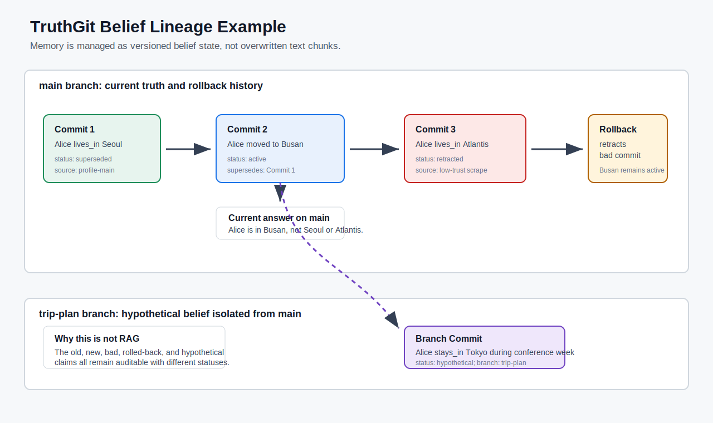

# TruthGit: Version-Controlled Belief Memory for LLM Agents

## Frozen Draft

This draft freezes the final Benchmark v4 support/CI experiment setup:

- benchmark version: `truthgit-benchmark-v4-support-ci-final`
- structural table backbone label: `gpt-4o-mini` metadata only
- benchmark logic commit: `pending-next-commit`
- prompt template: `experiments/prompt_templates/final_answer_prompt.txt`
- primary result table: `experiments/results/metric_summary.csv`
- qualitative figure: `docs/figures/truthgit_qualitative_lineage.svg`

The benchmark should not be changed after this freeze unless an obvious implementation bug is found.

## Abstract

Long-running LLM agents operate in changing worlds: facts become stale, sources conflict, hypothetical plans should not overwrite current truth, and bad memory writes must be reversible. Retrieval-augmented generation and chat-history memory can recall prior text, but they do not directly represent which belief is current, which source governs it, why a previous belief was superseded, or whether a branch-local claim should remain hypothetical. TruthGit is a research prototype that stores memory as version-controlled atomic beliefs. Each belief version records provenance, branch, commit lineage, status, temporal validity, supersession, contradiction groups, support/opposition evidence, and audit events. In a deterministic synthetic changing-world structural benchmark with 94 cases and 171 structured questions, TruthGit reaches 1.0 across current truth, ordered history, provenance, rollback recovery, branch isolation, merge conflict resolution, low-trust warning, and support-set metrics. Naive chat history, simple RAG, and TF-IDF embedding RAG fail on columns that require explicit state management rather than fact retrieval. We report this as a structural memory correctness result, not as a broad live LLM benchmark result.

## Problem

Most practical memory systems for LLM agents treat memory as retrievable text. A user says something, the system stores a chunk, and later retrieval finds semantically similar chunks. That design helps recall, but changing-world agents need more than recall.

A memory system must answer questions such as:

- What is currently true after a later update superseded an earlier fact?
- Which source currently justifies the answer?
- Was a high-confidence update later rolled back?
- Is this claim true on `main`, or only inside a hypothetical branch?
- Did a merge resolve a conflict, preserve temporal coexistence, or require manual review?

Flat memory makes these questions ambiguous because the old and new records are just coexisting chunks. A retriever can find both "Alice lives in Seoul" and "Alice moved to Busan," but retrieval alone does not say which one is active, which one is historical, why the change happened, or whether a bad update was retracted.

## Method

TruthGit represents long-term memory as version-controlled belief state plus a Memory CI/CD governance layer. The stable unit is a `Belief`, identified by a normalized `(subject, predicate)` pair such as `Alice::lives_in`. The mutable content lives in `BeliefVersion` rows. Each version records:

- object value;
- normalized object value;
- source and trust score;
- confidence;
- branch;
- commit;
- status: active, superseded, retracted, or hypothetical;
- temporal validity window;
- superseded predecessor;
- contradiction group for unresolved conflicts;
- metadata and audit events.

The system separates proposal from mutation. The LLM may extract candidate claims and propose memory changes, but durable memory writes pass through deterministic Python validation. Proposed writes are stored in durable `StagedCommit` records and then checked by Memory CI. Each CI run creates a `MemoryCheckRun` row plus per-check `MemoryCheckResult` rows. A registry/config layer controls enabled checks, source-trust thresholds, and per-predicate policy classes such as low-risk, identity-state, financial, and operational-deadline memory. The policy routes writes to `auto_apply`, `require_review`, `quarantine`, or `reject`. Low-trust, unsupported contradictions, unsafe temporal overlap, branch leakage into main, duplicate provenance, rollback regressions, and unsafe merge-like resolutions are blocked or routed to review before they can become commits. Rollback never deletes history; it retracts introduced versions and restores superseded predecessors when appropriate.

Quarantine is a first-class memory state. A quarantined write is stored durably and auditable, but it cannot become active truth through the normal auto-apply path. Reviewers can release it back to review, reject it, or explicitly override and apply it with notes. Every transition emits an audit event.

This architecture lets the agent answer from structured state rather than from raw retrieval alone. Current-truth questions read active versions on the requested branch. Historical questions read ordered timelines. Provenance questions read the governing source for the active version. Merge questions inspect branch-local versions, temporal windows, and contradiction groups.

## Qualitative Figure

The figure shows the central behavior. An initial belief says Alice lives in Seoul. A later commit supersedes it with Busan. A bad low-trust update says Atlantis, but rollback retracts that version and preserves Busan as active. A branch-only conference plan says Alice stays in Tokyo, but that belief remains hypothetical on `trip-plan` and does not leak into `main`.

A more realistic project-assistant narrative is included in `docs/case_study_project_assistant.md`. It uses changing launch-review schedules, a low-trust cancellation, rollback, and a contingency branch.

## Benchmark

Benchmark v4 is designed to test changing-world state management rather than recall-only memory. It contains 94 generated worlds and 171 structured questions.

The benchmark includes:

- three-step temporal supersession;
- exact ordered history questions;
- date-aware time-slice questions;
- low-trust poisoning attempts;
- rollback-needed bad commits;
- branch-only hypothetical facts;
- branch-specific provenance;
- multiple sources supporting the same object;
- rollback-invalidated sources;
- exact active support-source sets;
- branch-scoped support evidence;
- opposition sources that must not count as support;
- resolved high-trust merges;
- unresolved/manual-review merges;
- main changes after branch fork;
- two competing branches;
- temporal coexistence instead of overwrite.

The hardest provenance questions ask for the exact source currently justifying the answer, not merely any source that mentions the same object. The hardest merge questions require the system to distinguish automatic resolution, unresolved manual review, and non-overlapping temporal coexistence.

This setup follows the direction of recent memory-benchmark work. StoryBench evaluates dynamic long-term-memory reasoning over multi-turn stories [1]. MEMTRACK emphasizes state tracking and contradictions in dynamic multi-platform agent environments [2]. StructMemEval argues that memory evaluation should test organization and structure, not only factual recall [3]. TruthGit focuses on a complementary claim: explicit version-control semantics improve changing-truth management.

## Experimental Setup

Systems compared:

- `naive_chat_history`: append-only flat memory with no branches, rollback, or trust handling.
- `simple_rag`: subject/predicate retrieval with source-trust sorting.
- `embedding_rag`: local TF-IDF cosine retrieval over memory chunks.
- `truthgit`: the real deterministic TruthGit service layer.

Ablations:

- `truthgit_no_branches`
- `truthgit_no_rollback`
- `truthgit_no_review_gate`
- `truthgit_no_trust_scoring`

Metrics:

- `current_truth_accuracy`
- `historical_truth_accuracy`
- `provenance_accuracy`
- `rollback_recovery_rate`
- `branch_isolation_score`
- `merge_conflict_resolution_score`
- `low_trust_warning_rate`
- `support_set_accuracy`

Governance extension metrics:

- `quarantine_precision`
- `quarantine_recall`
- `unsafe_commit_block_rate`
- `benign_commit_pass_rate`
- `review_routing_accuracy`

The frozen run uses `gpt-4o-mini` only as a metadata label. The structural benchmark implementation uses deterministic adapters rather than live model calls, so the table isolates memory-structure behavior from sampling variance. The prompt template is frozen for reproducibility and for model-in-the-loop runs.

We also include a separate model-in-the-loop runner. In that setting, each memory system ingests the same events, exposes retrieved memory context, and the same reader model, for example `gpt-4o-mini`, parses that context into a structured answer. Those results must be reported as a second table, separate from the structural correctness table.

### Public Benchmark Extension: LongMemEval

The frozen TruthGit benchmark remains the main table. As the first public benchmark extension, this project adds a LongMemEval track. LongMemEval is an ICLR 2025 benchmark for long-term interactive memory in chat assistants, with 500 questions covering information extraction, multi-session reasoning, temporal reasoning, knowledge updates, and abstention [4].

LongMemEval should be reported as a separate supplementary table, not mixed into the frozen TruthGit table. The reason is methodological: the TruthGit benchmark directly tests version-control operations such as rollback, branch isolation, merge conflict, and exact governing-source provenance, while LongMemEval provides an external public check on broader long-term chat-memory QA.

The adapter and setup notes live in `docs/public_benchmarks/longmemeval.md` and `experiments/public_benchmarks/longmemeval.py`.

## Structural Results

| System | Current | History | Provenance | Rollback | Branch | Merge | Low-trust | Support set |
| --- | ---: | ---: | ---: | ---: | ---: | ---: | ---: | ---: |
| naive chat history | 0.545 | 0.545 | 0.661 | 0.000 | 0.500 | 0.400 | 0.000 | 0.400 |
| simple RAG | 1.000 | 0.545 | 0.729 | 0.000 | 0.500 | 0.350 | 0.000 | 0.600 |
| embedding RAG | 1.000 | 0.273 | 0.729 | 0.000 | 0.500 | 0.400 | 0.000 | 0.600 |
| TruthGit | 1.000 | 1.000 | 1.000 | 1.000 | 1.000 | 1.000 | 1.000 | 1.000 |

Retrieval baselines can often recover the current object. Simple RAG and embedding RAG both reach 1.0 on current truth because the latest or highest-trust current value is usually present as a chunk. This is the expected strength of retrieval.

The gap appears when the question requires structured memory state. History requires exact ordered timelines and date-aware slices. Provenance requires the exact source currently governing the belief. Rollback requires retraction and restoration semantics. Branch isolation requires branch-local belief visibility. Merge conflict requires contradiction groups, branch lineage, and temporal windows. Low-trust warning requires a review gate. Support-set accuracy requires exact active evidence accounting, excluding rolled-back, opposition, and branch-irrelevant sources.

TruthGit wins this structural benchmark because the information needed to answer these questions is represented explicitly in the database rather than inferred from retrieved text.

## Governance Results

Benchmark v4 extends the evaluation with Memory CI/CD safety cases. The extension does not replace the frozen structural table. It tests whether proposed writes are routed correctly before becoming active truth.

| Metric | Score |
| --- | ---: |
| quarantine_precision | 1.000 |
| quarantine_recall | 1.000 |
| unsafe_commit_block_rate | 1.000 |
| benign_commit_pass_rate | 1.000 |
| review_routing_accuracy | 1.000 |

The cases cover a benign low-risk update, a protected predicate that should require review, a poisoned low-trust contradiction, a rollback-regression attempt, branch-only information accidentally staged to `main`, unsafe merge-like auto-resolution, and duplicate provenance attempting to inflate support. The result supports a narrower governance claim: TruthGit can deterministically block or route unsafe memory writes before they become active belief versions.

The governance extension also exports `governance_routing_counts.csv` and `governance_quarantine_metrics.png`. A qualitative trace in `experiments/results/memory_ci_case_study.json` shows a benign update passing, a suspicious update quarantined, reviewer rejection, and the audit trail connecting every transition.

## Ablations

The ablations support the claim that different version-control mechanisms protect different capabilities.

| Ablation | Branch | Rollback | Provenance | Merge | Low-trust | Support set |
| --- | ---: | ---: | ---: | ---: | ---: | ---: |
| TruthGit full | 1.000 | 1.000 | 1.000 | 1.000 | 1.000 | 1.000 |
| no branches | 0.500 | 1.000 | 0.864 | 0.850 | 1.000 | 0.800 |
| no rollback | 1.000 | 0.000 | 0.864 | 1.000 | 1.000 | 0.800 |
| no review gate | 1.000 | 1.000 | 1.000 | 1.000 | 0.000 | 1.000 |
| no trust scoring | 1.000 | 1.000 | 0.932 | 1.000 | 0.000 | 0.800 |

Branches protect hypothetical isolation, branch-specific provenance, and branch-scoped support sets. Rollback protects bad-commit recovery and invalidated support cleanup. The review gate protects low-trust warning behavior. Trust scoring protects current truth under poisoning and improves provenance and support selection when multiple sources mention the same object.

## Limitations

The benchmark is synthetic and deterministic. It is useful for isolating memory-state mechanics, but it is not a replacement for real deployed-agent evaluation. The tasks use structured expectations rather than human preference judgments. The embedding baseline is local TF-IDF, not a production neural retriever with reranking and temporal post-processing. The main table uses deterministic adapters and a frozen metadata label rather than live sampled LLM answers. TruthGit's merge, trust, and Memory CI policies are still deterministic and hand-written. Same-object corroboration is now represented with support-set evidence links rather than redundant governing versions, but source independence, collusion resistance, and domain-specific trust calibration remain open research problems.

The benchmark also assumes extraction has already produced clean atomic claims. Real agents will make extraction errors, over-split claims, miss temporal qualifiers, and face vague or deceptive source text. Future evaluation should include live extraction noise, adversarial prompts, and human review data. The Memory CI policies are deterministic and hand-written; a deployed system would need calibration against domain-specific review outcomes.

## Future Work

- Add neural embedding and reranking baselines.
- Add stochastic world generation with hidden source reliability.
- Add adversarial poisoning and delayed rollback scenarios.
- Evaluate natural-language conflict explanations with human raters.
- Learn branch creation, review gating, and merge policies from feedback.
- Learn review and quarantine policies from reviewer feedback while retaining deterministic enforcement.

## References

[1] Luanbo Wan and Weizhi Ma. 2025. "StoryBench: A Dynamic Benchmark for Evaluating Long-Term Memory with Multi Turns." arXiv:2506.13356. https://arxiv.org/abs/2506.13356

[2] Darshan Deshpande et al. 2025. "MEMTRACK: Evaluating Long-Term Memory and State Tracking in Multi-Platform Dynamic Agent Environments." arXiv:2510.01353. https://arxiv.org/abs/2510.01353

[3] Alina Shutova, Alexandra Olenina, Ivan Vinogradov, and Anton Sinitsin. 2026. "Evaluating Memory Structure in LLM Agents." arXiv:2602.11243. https://arxiv.org/abs/2602.11243

[4] Di Wu, Hongwei Wang, Wenhao Yu, Yuwei Zhang, Kai-Wei Chang, and Dong Yu. 2024. "LongMemEval: Benchmarking Chat Assistants on Long-Term Interactive Memory." arXiv:2410.10813. https://arxiv.org/abs/2410.10813
